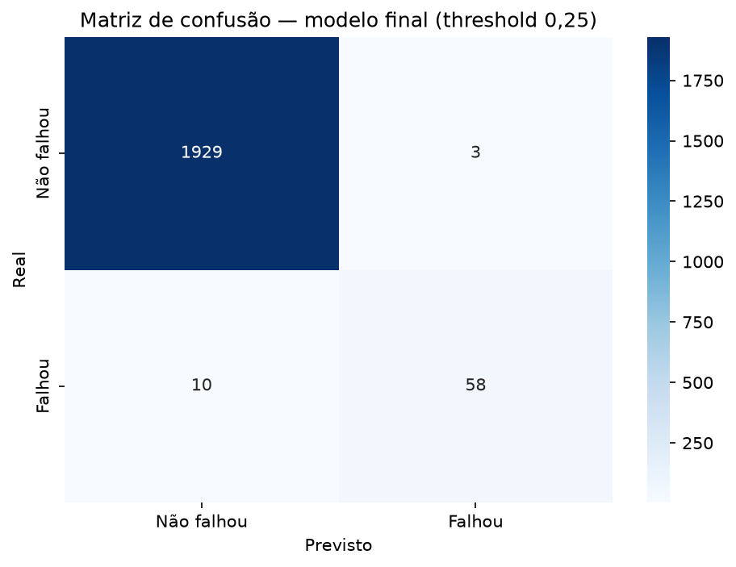
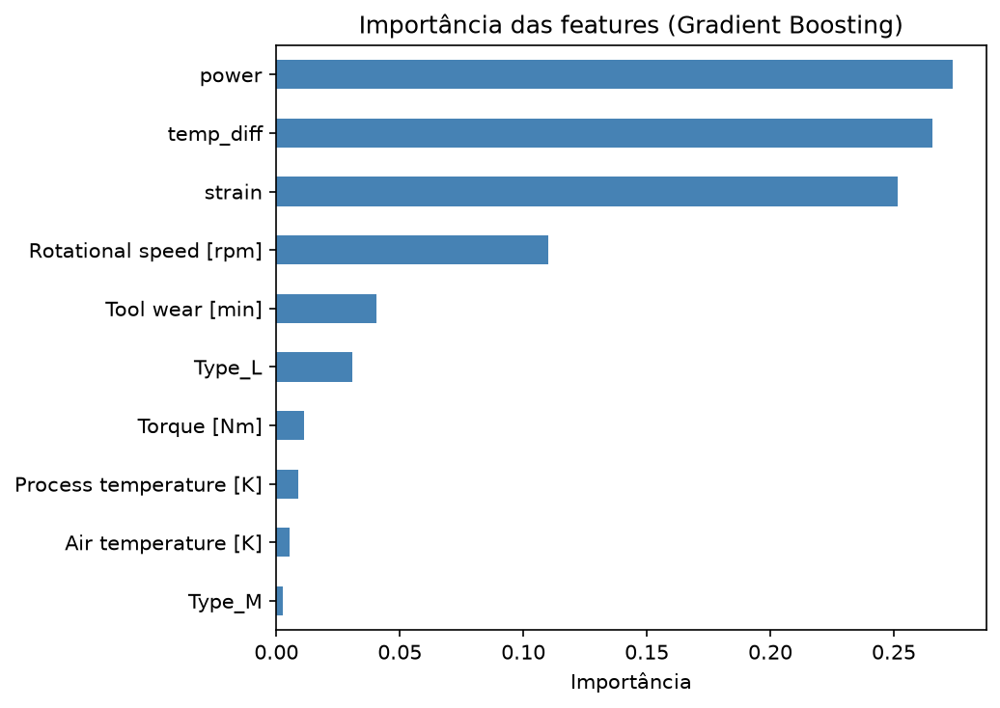
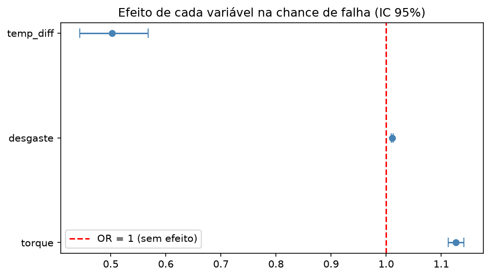

# IndustrIA — Manutenção Preditiva Industrial

Prevê se uma máquina está em risco de falhar a partir das leituras dos seus
sensores, para que a manutenção aja **antes da quebra** — sem trocar peças
saudáveis à toa.

> 🚧 **Em construção** — projeto de portfólio feito em etapas versionadas.
> Dados, EDA, estatística, modelo e inferência concluídos. 

## Problema de negócio

Numa operação industrial, uma falha não planejada para a produção e sai caro.
Mas fazer manutenção cedo demais desperdiça peças e mão de obra. O objetivo é o
equilíbrio: **pegar as falhas reais cedo, evitando alarmes falsos.**

**Pergunta:** dadas as leituras atuais dos sensores de uma máquina (temperatura
do ar/processo, rotação, torque, desgaste da ferramenta), ela está em risco de
falhar? (sim / não)

Como falha é rara (~3,4% dos casos), o foco de avaliação é **precision/recall**
(não acurácia), com **threshold calibrado por custo**.

## Dados

Duas fontes integradas via **SQL** (modelagem fato + dimensão):

1. **Leituras de sensores** — AI4I 2020 Predictive Maintenance Dataset (UCI),
   público e de benchmark (~10.000 linhas). *Sintético por construção — não são
   dados reais de fábrica.*
2. **Cadastro de máquinas** — dimensão que traduz o tipo (L/M/H → Low/Medium/High),
   unida às leituras por `JOIN`.

## Abordagem

Ingestão → qualidade dos dados → carga e `JOIN` em SQL → EDA + estatística →
engenharia de atributos → modelo + avaliação → inferência.

## Principais achados (dados)

- Máquinas de **qualidade baixa** falham quase o **dobro** das de alta
  (3,92% vs 2,09%).
- **Torque** e **desgaste da ferramenta** são significativamente maiores nas
  falhas (teste t de Welch, **p < 0,001**) — os sinais preditivos mais fortes.
- Nenhuma variável isolada separa falha/não-falha (boxplots com sobreposição)
  → justifica um **modelo multivariado**.
- Features físicas alinhadas aos modos de falha do dataset:
  `power` (torque×rotação), `temp_diff` e `strain` (desgaste×torque).

## Resultados do modelo

Comparação de 3 modelos por **validação cruzada** (f1, sem tocar o teste):

| Modelo | f1 (CV) |
|---|---|
| Regressão Logística | 0,27 |
| Random Forest | 0,86 |
| **Gradient Boosting** ✅ | **0,89** |

> ⚠️ **Sem vazamento:** os rótulos de modo de falha (`TWF/HDF/PWF/OSF/RNF`) foram
> removidos das features — só existem no momento da falha.

Modelo final (Gradient Boosting) no **conjunto de teste**, com **threshold
calibrado por custo** (falha 10× mais cara que alarme falso → corte 0,25):

- **Recall: 85%** — pega 58 de 68 falhas.
- **Precision: 95%** — só 3 alarmes falsos em 2.000 máquinas.
- Baseline "sempre prevê não-falha": 96,6% de acurácia mas **0% de recall** —
  a prova de que acurácia engana em dado desbalanceado.

## Interpretação — por que falha (inferência)

Uma regressão logística interpretável quantifica o efeito de cada variável na
chance de falha (odds ratio com intervalo de confiança 95%):

- **Torque:** cada N·m aumenta ~13% a chance de falha.
- **Desgaste:** cada minuto aumenta ~1%.
- **Diferença de temperatura:** cada grau reduz ~50% (protege — dissipação de calor).

> **Rigor:** as features derivadas (`power`, `strain`) são colineares com o torque
> (VIF alto), então ficam só no modelo preditivo e são excluídas da regressão
> interpretável — **prever e explicar pedem ferramentas diferentes**.

## Stack

Python · pandas · NumPy · SQL (SQLite) · SciPy · scikit-learn · statsmodels ·
Matplotlib · Seaborn · Git.

## Como rodar

    git clone https://github.com/IsantoDev/industria-preditiva.git
    cd industria-preditiva
    python -m venv .venv
    .\.venv\Scripts\Activate.ps1
    pip install -e .
    python src/industria/download_data.py   # baixa o dataset
    python src/industria/database.py        # monta o banco SQLite
    # EDA:        notebooks/01_eda.ipynb
    # Modelo:     notebooks/02_modelagem.ipynb
    # Inferência: notebooks/03_inferencia.ipynb

## Roadmap

- [x] Ingestão + qualidade + SQL
- [x] EDA + estatística
- [x] Engenharia de atributos
- [x] Modelo + avaliação (precision/recall, threshold por custo)
- [x] Camada de inferência (por que falha + confiança)

## Autor

**Igor Ribeiro dos Santos**
[github.com/IsantoDev](https://github.com/IsantoDev) ·
[linkedin.com/in/isantosdev](https://linkedin.com/in/isantosdev)